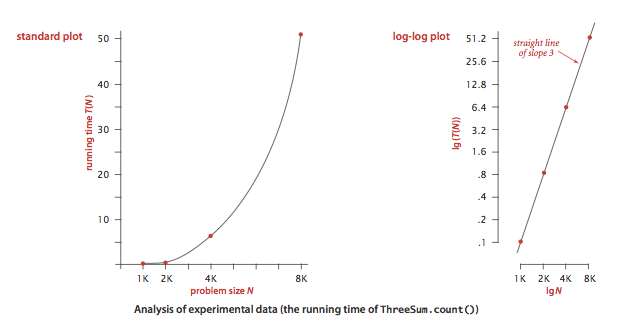
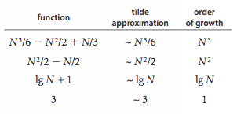
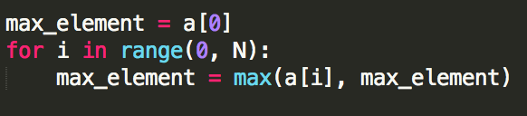
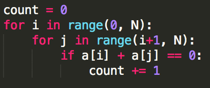

# Analyzing Algorithms


As people gain experience using computers, they use them to solve difficult problems or to process large amounts of data and are invariably led to questions like these:

- _How long will my program take?_
- _Why does my program run out of memory?_


__Scientific method.__ The very same approach that scientists use to understand the natural world is effective for studying the running time of programs:
- _Observe_ some feature of the natural world, generally with precise measurements.
- _Hypothesize_ a model that is consistent with the observations.
- _Predict_ events using the hypothesis.
- _Verify_ the predictions by making further observations.
- _Validate_ by repeating until the hypothesis and observations agree.

The experiments we design must be _reproducible_ and the hypotheses that we formulate must be _falsifiable_.

__Observations.__ Our first challenge is to determine how to make quantitative measurements of the running time of our programs. [stopwatch.py](src/src/stopwatch.py) is a data type that measures the elapsed running time of a program

```
class Stopwatch:
    # create and start a stop watch
    def __init__(self):

    # returns elapsed time since stopwatch was started
    def elapsed_time(self):
```


[three_sum.py](src/three_sum.py) counts the number of triples in a file of N integers that sums to 0 (ignoring integer overflow). [doubling_test.py](src/doubling_test.py) generates a sequence of random input arrays, doubling the array size at each step, and prints the running times of __ThreeSum.count()__ for each input size. It also prints the ratios between the inputs.




__Mathematical models.__ The total running time of a program is determined by two primary factors: the cost of executing each statement and the frequency of execution of each statement.

- _Tilde approximations._ We use tilde approximations, where we throw away low-order terms that complicate formulas. We write _~f(N)_ to represent any function that when divided by _f(N)_ approaches 1 as _N_ grows. We write _g(N) ~ f(N)_ to indicate that _g(N) / f(N)_ approaches 1 as _N_ grows.



- _Order-of-growth classifications._ Most often, we work with tilde approximations of the form _g(N) ~ a f(N)_ where _f(N) = N^b log^c N_ and refer to _f(N)_ as the The order of growth of _g(N)_. We use just a few structural primitives (statements, conditionals, loops, nesting, and method calls) to implement algorithms, so very often the order of growth of the cost is one of just a few functions of the problem size _N_.


| Description  | Order of Growth | Typical Code Framework | Description        | Example           |
|--------------|-----------------|------------------------|--------------------|-------------------|
| Constant     | 1               | a = b + c              | statement          | add two numbers   |
| Logarithmic  | log _N_         | [binary_search.py](src/binary_search.py)      | divide in half     | binary search     |
| Linear       | _N_             |                   | for loop           | find the maximum  |
| Linearithmic | _N_ log _N_     | [mergesort.py](src/../../2_sorting/2_mergesort/mergesort.py)                  | divide and conquer | mergesort         |
| Quadratic    | _N_<sup>2</sup> |                   | double for loop    | check all pairs   |
| Cubic        | _N_<sup>3</sup> |                   | triple for loop    | check all triples |
| Exponential  | 2<sup>_N_</sup> | [subsets.py](src/subsets.py)                  | exhaustive search  | check all subsets |

- _Cost model._ We focus attention on properties of algorithms by articulating a cost model that defines the basic operations. For example, an appropriate cost model for the 3-sum problem is the number of times we access an array entry, for read or write.

__Property.__ The order of growth of the running time of [three_sum.py](src/three_sum.py) is `N^3`.

__Proposition.__ The brute-force 3-sum algorithm uses `~N^3 / 2` array accesses to compute the number of triples that sum to 0 among N numbers.

__Designing faster algorithms.__ One of the primary reasons to study the order of growth of a program is to help design a faster algorithm to solve the same problem. Using mergesort and binary search, we develop faster algorithms for the 2-sum and 3-sum problems.

- _2-sum._ The brute-force solution [two_sum.py](src/two_sum.py) takes time proportional to N^2. [two_sum_fast.py](src/two_sum_fast.py) solves the 2-sum problem in time proportional to `N log N` time.
- _3-sum._ [three_sum_fast.py](src/three_sum_fast.py) solves the 3-sum problem in time proportional to `N^2 log N` time.

__Coping with dependence on inputs.__ For many problems, the running time can vary widely depending on the input.

- _Input models._ We can carefully model the kind of input to be processed. This approach is challenging because the model may be unrealistic.
- _Worst-case performance guarantees._ Running time of a program is less than a certain bound (as a function of the input size), no matter what the input. Such a conservative approach might be appropriate for the software that runs a nuclear reactor or a pacemaker or the brakes in your car.
- _Randomized algorithms._ One way to provide a performance guarantee is to introduce randomness, e.g., quicksort and hashing. Every time you run the algorithm, it will take a different amount of time. These guarantees are not absolute, but the chance that they are invalid is less than the chance your computer will be struck by lightning. Thus, such guarantees are as useful in practice as worst-case guarantees.
- _Amortized analysis._ For many applications, the algorithm input might be not just data, but the sequence of operations performed by the client. Amortized analysis provides a worst-case performance guarantee on a sequence of operations.

__Proposition.__ In the linked-list implementation of __Bag__, __Stack__, and __Queue__, all operations take constant time in the worst case.

__Proposition.__ In the resizing-array implementation of __Bag__, __Stack__, and __Queue__, starting from an empty data structure, any sequence of N operations takes time proportional to N in the worst case (amortized constant time per operation).

__Memory usage.__ To estimate how much memory our program uses, we can count up the number of variables and weight them by the number of bytes according to their type. Often this will be done in terms of the input using big `O` notation like with runtimes.

## Review Exercises
Here are some practice exercises you can work on which will ultimately help with the take home. Please feel free to reach out on Slack if you have any questions about these exercises.

1. Give the order of growth (as a function of N) of the running times of each of the following code fragments:
```
# Block (a)
sum = 0;
n = N
while n > 0: 
    for i in range(0, n):
        sum += 1;
    n = n // 2


# Block (b)
sum = 0
i = 1
while i < N:
    for j in range(0, i):
        sum += 1
    i = i * 2

# Block (c)
sum = 0
i = 1
while i < N:
    for j in range(0, N):
        sum += 1
    i = i * 2
```

2. __Find a duplicate.__ Given an array of N elements in which each element is an integer between 1 and N, write an algorithm to determine if there are any duplicates. Your algorithm should run in linear time and use O(1) extra space. Hint: you may destroy the array.

3. __Monotone 2d array.__ Give an n-by-n array of elements such that each row is in ascending order and each column is in ascending order, devise an O(n) algorithm to determine if a given element x in the array. You may assume all elements in the n-by-n array are distinct.

