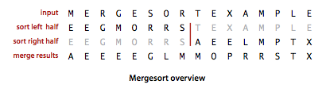

# Mergesort 

The algorithms that we consider in this section is based on a simple operation known as _merging_: combining two ordered arrays to make one larger ordered array. This operation immediately lends itself to a simple recursive sort method known as _mergesort_: to sort an array, divide it into two halves, sort the two halves (recursively), and then merge the results.

Mergesort guarantees to sort an array of _N_ items in time proportional to _N log N_, no matter what the input. Its prime disadvantage is that it uses extra space proportional to _N_.

__Abstract in-place merge.__ The method merge(a, lo, mid, hi) in [mergesort.py](src/mergesort.py) puts the results of merging the subarrays __a[lo..mid]__ with __a[mid+1..hi]__ into a single ordered array, leaving the result in __a[lo..hi]__. While it would be desirable to implement this method without using a significant amount of extra space, such solutions are remarkably complicated. Instead, __merge()__ copies everything to an auxiliary array and then merges back to the original.

__Top-down mergesort.__ [mergesort.py](src/mergesort.py) has a recursive mergesort implementation based on this abstract in-place merge. It is one of the best-known examples of the utility of the _divide-and-conquer_ paradigm for efficient algorithm design.

__Proposition.__ Top-down mergesort uses between _1/2 N lg N_ and _N lg N_ compares and at most _6 N lg N_ array accesses to sort any array of length _N_.

__Improvements.__ We can cut the running time of mergesort substantially with some carefully considered modifications to the implementation.

- _Use insertion sort for small subarrays._ We can improve most recursive algorithms by handling small cases differently. Switching to insertion sort for small subarrays will improve the running time of a typical mergesort implementation by 10 to 15 percent.

- _Test whether array is already in order._ We can reduce the running time to be linear for arrays that are already in order by adding a test to skip call to __merge()__ if __a[mid]__ is less than or equal to __a[mid+1]__. With this change, we still do all the recursive calls, but the running time for any sorted subarray is linear.

- _Eliminate the copy to the auxiliary array._ It is possible to eliminate the time (but not the space) taken to copy to the auxiliary array used for merging. To do so, we use two invocations of the sort method, one that takes its input from the given array and puts the sorted output in the auxiliary array; the other takes its input from the auxiliary array and puts the sorted output in the given array. With this approach, in a bit of mindbending recursive trickery, we can arrange the recursive calls such that the computation switches the roles of the input array and the auxiliary array at each level.

__Visualization.__ Below is a visualization of mergesort with cutoff for small subarrays.

__Bottom-up mergesort.__ Even though we are thinking in terms of merging together two large subarrays, the fact is that most merges are merging together tiny subarrays. Another way to implement mergesort is to organize the merges so that we do all the merges of tiny arrays on one pass, then do a second pass to merge those arrays in pairs, and so forth, continuing until we do a merge that encompasses the whole array. This method requires even less code than the standard recursive implementation. We start by doing a pass of 1-by-1 merges (considering individual items as subarrays of size 1), then a pass of 2-by-2 merges (merge subarrays of size 2 to make subarrays of size 4), then 4-by-4 merges, and so forth. [mergesort.py](src/mergesort.py) has an implementation of bottom-up mergesort.

__Proposition.__ Bottom-up mergesort uses between _1/2 N lg N_ and _N lg N_compares and at most _6 N lg N_ array accesses to sort any array of length _N_.

__Proposition.__ No compare-based sorting algorithm can guarantee to sort _N_ items with fewer than _lg(N!) ~ N lg N_ compares.

__Proposition.__ Mergesort is an asymptotically optimal compare-based sorting algorithm. That is, both the number of compares used by mergesort in the worst case and the minimum number of compares that any compare-based sorting algorithm can guarantee are _~N lg N_.

# Review Exercises
Here are some practice exercises you can work on which will ultimately help with the take home. Please feel free to reach out on Slack if you have any questions about these exercises.

1. Give traces, in the style of the trace given in this section, showing how the keys `E A S Y Q U E S T I O N` are sorted with top-down mergesort and with bottom-up mergesort.
2. Does the abstract inplace merge produce proper output if and only if the two input subarrays are in sorted order? Prove your answer, or provide a counterexample.
3. Describe in words why mergesort is a stable sort.

