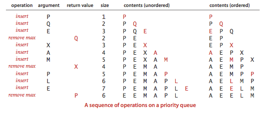
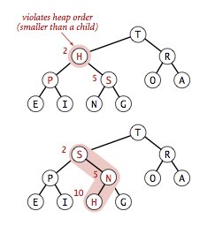
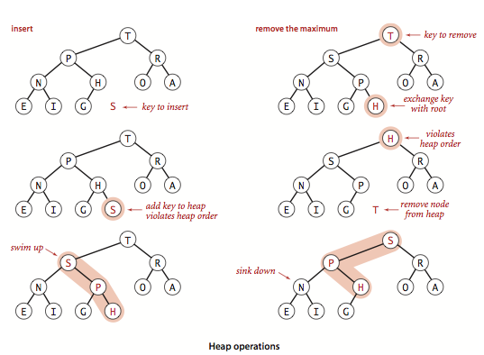
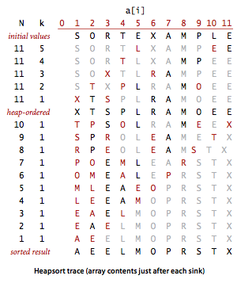

# Priority Queues

Many applications require that we process items having keys in order, but not necessarily in full sorted order and not necessarily all at once. Often, we collect a set of items, then process the one with the largest key, then perhaps collect more items, then process the one with the current largest key, and so forth. An appropriate data type in such an environment supports two operations: _remove the maximum_ and _insert_. Such a data type is called a _priority queue_.

__API.__ Priority queues are characterized by the _remove the maximum_ and _insert_ operations. By convention, we will compare keys only with a __less()__ method, as we have been doing for sorting. Thus, if records can have duplicate keys, _maximum_ means any record with the largest key value. To complete the API, we also need to add constructors and a test if empty operation. For flexibility, we use a general Key object with a __compareTo__ method. We will use _k_ to refer to an arbitrary Key object.

```
class MaxPriorityQueue:
    # creates a max priority queue of initial capacity max_size if provided
    def __init__(self, max_size = None): 

    # inserts a key into the priority queue
    def insert(self, key): 

    # returns the largest key
    def get_max(self):

    # return and remove the largest key
    def delMax(self):

    # returns a boolean indicating if the priority queue empty
    def isEmpty(self):

    # returns the number of keys in the priority queue
    def size():
```


__Elementary implementations.__ There are 4 ways to implement priority queues.

- _Array representation (unordered)_. Perhaps the simplest priority queue implementation is based on our code for pushdown stacks. The code for _insert_ in the priority queue is the same as for _push_ in the stack. To implement _remove the maximum_, we can add code like the inner loop of selection sort to exchange the maximum item with the item at the end and then delete that one, as we did with __pop()__ for stacks. Program [unordered_array_max_pq.py](src/unordered_array_max_pq.py) implements a priority queue using this approach.
- _Array representation (ordered)._ Another approach is to add code for insert to move larger entries one position to the right, thus keeping the entries in the array in order (as in insertion sort). Thus the largest item is always at the end, and the code for _remove the maximum_ in the priority queue is the same as for pop in the stack. Program [ordered_array_max_pq.py](src/ordered_array_max_pq.py) implements a priority queue using this approach.
- _Linked-list representations (unordered and reverse-ordered)._ Similarly, we can start with our linked-list code for pushdown stacks, either modifying the code for __pop()__ to find and return the maximum or the code for __push()__ to keep items in reverse order and the code for __pop()__ to unlink and return the first (maximum) item on the list.



All of the elementary implementations just discussed have the property that either the insert or the _remove the maximum_ operation takes linear time in the worst case. Finding an implementation where both operations are guaranteed to be fast is a more interesting task, and it is the main subject of this section.

__Heap definitions.__ The _binary heap_ is a data structure that can efficiently support the basic priority-queue operations. In a binary heap, the items are stored in an array such that each key is guaranteed to be larger than (or equal to) the keys at two other specific positions. In turn, each of those keys must be larger than two more keys, and so forth. This ordering is easy to see if we view the keys as being in a binary tree structure with edges from each key to the two keys known to be smaller.

__Definition.__ A binary tree is _heap-ordered_ if the key in each node is larger than (or equal to) the keys in that nodes two children (if any).

__Proposition.__ The largest key in a heap-ordered binary tree is found at the root.

We can impose the heap-ordering restriction on any binary tree. It is particularly convenient, however, to use a _complete_ binary tree like the one below.


We represent complete binary trees sequentially within an array by putting the nodes with _level order_, with the root at position 1, its children at positions 2 and 3, their children in positions 4, 5, 6 and 7, and so on.

__Definition.__ A _binary heap_ is a set of nodes with keys arranged in a complete heap-ordered binary tree, represented in level order in an array (not using the first entry).


In a heap, the parent of the node in position _k_ is in position _k/2_; and, conversely, the two children of the node in position _k_ are in positions _2k_ and _2k + 1_. We can travel up and down by doing simple arithmetic on array indices: to move up the tree from __a[k]__ we set _k_ to _k/2_; to move down the tree we set _k_ to _2*k_ or _2*k+1_.

__Algorithms on heaps.__ We represent a heap of size _n_ in private array __pq[]__ of length _n + 1_, with __pq[0]__ unused and the heap in __pq[1]__ through __pq[n]__. We access keys only through private helper functions __less()__ and __exch()__. The heap operations that we consider work by first making a simple modification that could violate the heap condition, then traveling through the heap, modifying the heap as required to ensure that the heap condition is satisfied everywhere. We refer to this process as _reheapifying_, or _restoring heap order_.

- _Bottom-up reheapify (swim)._ If the heap order is violated because a node's key becomes larger than that node's parents key, then we can make progress toward fixing the violation by exchanging the node with its parent. After the exchange, the node is larger than both its children (one is the old parent, and the other is smaller than the old parent because it was a child of that node) but the node may still be larger than its parent. We can fix that violation in the same way, and so forth, moving up the heap until we reach a node with a larger key, or the root.


```
def _swim(self, k):
   while k > 1 and self.less(k/2, k)):
      self.exch(k, k/2);
      k = k/2;
```


- _Top-down heapify (sink)._ If the heap order is violated because a node's key becomes smaller than one or both of that node's children's keys, then we can make progress toward fixing the violation by exchanging the node with the larger of its two children. This switch may cause a violation at the child; we fix that violation in the same way, and so forth, moving down the heap until we reach a node with both children smaller, or the bottom.



```
def _sink(self, k):
    while 2*k <= N:j = 2*k
        if j < N && self.less(j, j+1)):
            j += 1
        if (!self.less(k, j)):
            break
        self.exch(k, j);
        k = j;
```


__Heap-based priority queue.__ These __sink()__ and __swim()__ operations provide the basis for efficient implementation of the priority-queue API, as diagrammed below and implemented in [max_pq.py](src/max_pq.py) and [min_pq](src/min_pq.py).

- _Insert._ We add the new item at the end of the array, increment the size of the heap, and then swim up through the heap with that item to restore the heap condition.
- _Remove the maximum._ We take the largest item off the top, put the item from the end of the heap at the top, decrement the size of the heap, and then sink down through the heap with that item to restore the heap condition.




__Proposition.__ In an _n_-item priority queue, the heap algorithms require no more than 1 + lg n compares for _insert_ and no more than _2 lg n_ compares for _remove the maximum_.

__Practical considerations.__ We conclude our study of the heap priority queue API with a few practical considerations.
- _Multiway heaps._ It is not difficult to modify our code to build heaps based on an array representation of complete heap-ordered ternary or _d_-ary trees. There is a tradeoff between the lower cost from the reduced tree height and the higher cost of finding the largest of the three or _d_ children at each node.
- _Array resizing._ We can add a no-argument constructor, code for array doubling in __insert()__, and code for array halving in __delMax()__, just as we did for stacks in Section 1.3. The logarithmic time bounds are amortized when the size of the priority queue is arbitrary and the arrays are resized.
- _Immutability of keys._ The priority queue contains objects that are created by clients but assumes that the client code does not change the keys (which might invalidate the heap invariants).

__Heapsort.__ We can use any priority queue to develop a sorting method. We insert all the keys to be sorted into a minimum-oriented priority queue, then repeatedly use _remove the minimum_ to remove them all in order. When using a heap for the priority queue, we obtain _heapsort_.

Focusing on the task of sorting, we abandon the notion of hiding the heap representation of the priority queue and use __swim()__ and __sink()__ directly. Doing so allows us to sort an array without needing any extra space, by maintaining the heap within the array to be sorted. Heapsort breaks into two phases: _heap construction_, where we reorganize the original array into a heap, and the _sortdown_, where we pull the items out of the heap in decreasing order to build the sorted result.

- _Heap construction._ We can accomplish this task in time proportional to _n lg n_,by proceeding from left to right through the array, using __swim()__ to ensure that the entries to the left of the scanning pointer make up a heap-ordered complete tree, like successive priority queue insertions. A clever method that is much more efficient is to proceed from right to left, using __sink()__ to make subheaps as we go. Every position in the array is the root of a small subheap; __sink()__ works or such subheaps, as well. If the two children of a node are heaps, then calling __sink()__ on that node makes the subtree rooted there a heap.
- _Sortdown._ Most of the work during heapsort is done during the second phase, where we remove the largest remaining items from the heap and put it into the array position vacated as the heap shrinks.


Below is a trace of the contents of the array after each sink.



__Proposition.__ Sink-based heap construction is linear time.


__Proposition.__ Heapsort users fewer than _2 n lg n_ compare and exchanges to sort n items.

Most items reinserted into the heap during sortdown go all the way to the bottom. We can thus save time by avoiding the check for whether the item has reached its position, simply promoting the larger of the two children until the bottom is reached, then moving back up the heap to the proper position. This idea cuts the number of compares by a factor of 2 at the expense of extra bookkeeping.

# Review Exercises
Here are some practice exercises you can work on which will ultimately help with the take home. Please feel free to reach out on Slack if you have any questions about these exercises.

1. Suppose that the sequence
```
P R I O * R * * I * T * Y * * * Q U E * * * U * E
```
(where a letter means insert and an asterisk means remove the maximum) is applied to an initially empty priority queue. Give the sequence of values returned by remove the maximum operations.

2. Criticize the following idea: to implement find the maximum in constant time, why not keep track of the maximum value inserted so far, then return that value for find the maximum?
3. Is an array that is sorted in decreasing order a max-oriented heap?
4. Suppose that your application will have a huge number of insert operations, but only a few remove the maximum operations. Which priority-queue implementation do you think would be most effective: heap, unordered array, ordered array?
5. Suppose that your application will have a huge number of find the maximum operations, but a relatively small number of insert and remove the maximum operations. Which priority queue implementation do you think would be most effective: heap, unordered array, ordered array?
6. __Best, average, and worst case of heapsort.__ What's are the best case, average case, and worst case number of compares for heapsorting an array of length n?
7. __Top k sums of two sorted arrays.__ Given two sorted arrays `a[]` and `b[]`, each of length n, find the largest k sums of the form `a[i] + b[j]`.


