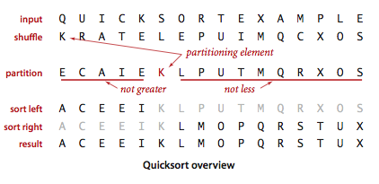
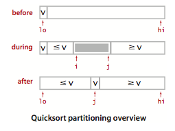

# Quicksort

Quicksort is popular because it is not difficult to implement, works well for a variety of different kinds of input data, and is substantially faster than any other sorting method in typical applications. It is in-place (uses only a small auxiliary stack), requires time proportional to _N log N_ on the average to sort _N_ items, and has an extremely short inner loop.

__The basic algorithm.__ Quicksort is a divide-and-conquer method for sorting. It works by _partitioning_ an array into two parts, then sorting the parts independently.

The crux of the method is the partitioning process, which rearranges the array to make the following three conditions hold:

- The entry __a[j]__ is in its final place in the array, for some __j__.
- No entry in __a[lo]__ through __a[j-1]__ is greater than __a[j]__.
- No entry in __a[j+1]__ through __a[hi]__ is less than __a[j]__.

We achieve a complete sort by partitioning, then recursively applying the method to the subarrays. It is a _randomized_ algorithm, because it randomly shuffles the array before sorting it.

__Partitioning.__ To complete the implementation, we need to implement the partitioning method. We use the following general strategy: First, we arbitrarily choose __a[lo]__ to be the partitioning item—the one that will go into its final position. Next, we scan from the left end of the array until we find an entry that is greater than (or equal to) the partitioning item, and we scan from the right end of the array until we find an entry less than (or equal to) the partitioning item.

The two items that stopped the scans are out of place in the final partitioned array, so we exchange them. When the scan indices cross, all that we need to do to complete the partitioning process is to exchange the partitioning item __a[lo]__ with the rightmost entry of the left subarray (__a[j]__) and return its index __j__.

__Quicksort.__ [quicksort.py](src/quicksort.py) is an implementation of quicksort, using the partitioning method described above.

__Implementation details.__ There are several subtle issues with respect to implementing quicksort that are reflected in this code and worthy of mention.

- _Partitioning inplace._ If we use an extra array, partitioning is easy to implement, but not so much easier that it is worth the extra cost of copying the partitioned version back into the original.
- _Staying in bounds._ If the smallest item or the largest item in the array is the partitioning item, we have to take care that the pointers do not run off the left or right ends of the array, respectively.
- _Preserving randomness._ The random shuffle puts the array in random order. Since it treats all items in the subarrays uniformly, [quicksort.py](src/quicksort.py) has the property that its two subarrays are also in random order. This fact is crucial to the algorithm's predictability. An alternate way to preserve randomness is to choose a random item for partitioning within __partition()__.
- _Terminating the loop._ Properly testing whether the pointers have crossed is a bit trickier than it might seem at first glance. A common error is to fail to take into account that the array might contain other keys with the same value as the partitioning item.
- _Handling items with keys equal to the partitioning item's key._ It is best to stop the left scan for items with keys greater than or equal to the partitioning item's key and the right scan for items less than or equal to the partitioning item's key. Even though this policy might seem to create unnecessary exchanges involving items with keys equal to the partitioning item's key, it is crucial to avoiding quadratic running time in certain typical applications.
- _Terminating the recursion._ A common mistake in implementing quicksort involves not ensuring that one item is always put into position, then falling into an infinite recursive loop when the partitioning item happens to be the largest or smallest item in the array.

__Proposition.__ Quicksort uses _~2 N ln N_ compares (and one-sixth that many exchanges) on the average to sort an array of length _N_ with distinct keys.
Proposition. Quicksort uses _~N2/2_ compares in the worst case, but random shuffling protects against this case.

The standard deviation of the running time is about _.65 N_, so the running time tends to the average as N grows and is unlikely to be far from the average. The probability that quicksort will use a quadratic number of compares when sorting a large array on your computer is much less than the probability that your computer will be struck by lightning!

__Improvements.__ Quicksort was invented in 1960 by C. A. R. Hoare, and it has been studied and refined by many people since that time.

- _Cutoff to insertion sort._ As with mergesort, it pays to switch to insertion sort for tiny arrays. The optimum value of the cutoff is system-dependent, but any value between 5 and 15 is likely to work well in most situations.
- _Median-of-three partitioning._ A second easy way to improve the performance of quicksort is to use the median of a small sample of items taken from the array as the partitioning item. Doing so will give a slightly better partition, but at the cost of computing the median. It turns out that most of the available improvement comes from choosing a sample of size 3 (and then partitioning on the middle item).

__Visualization.__ Below is a visualization of quicksort with median-of-3 partitioning and cutoff for small subarrays.

__Entropy-optimal sorting.__ Arrays with large numbers of duplicate sort keys arise frequently in applications. In such applications, there is potential to reduce the time of the sort from linearithmic to linear.

One straightforward idea is to partition the array into three parts, one each for items with keys smaller than, equal to, and larger than the partitioning item's key. Accomplishing this partitioning was a classical programming exercise popularized by E. W. Dijkstra as the _Dutch National Flag_ problem, because it is like sorting an array with three possible key values, which might correspond to the three colors on the flag.

Dijkstra's solution is based on a single left-to-right pass through the array that maintains a pointer lt such that __a[lo..lt-1]__ is less than __v__, a pointer gt such that __a[gt+1..hi]__ is greater than __v__, and a pointer __i__ such that __a[lt..i-1]__ are equal to __v__, and __a[i..gt]__ are not yet examined.

Starting with __i__ equal to lo we process __a[i]__ using the 3-way compare given us by the compareTo method to handle the three possible cases:

- __a[i]__ less than __v__: exchange __a[lt]__ with __a[i]__ and increment both __lt__ and __i__
- __a[i]__ greater than __v__: exchange __a[i]__ with __a[gt]__ and decrement __gt__
- __a[i]__ equal to __v__: increment __i__

[quicksort_3way.py](src/quicksort_3way.py) is an implementation of this method.

__Proposition.__ Quicksort with 3-way partitioning is entropy-optimal.

__Visualization.__ Below is a visualization of quicksort with 3-way partitioning.

# Review Exercises
Here are some practice exercises you can work on which will ultimately help with the take home. Please feel free to reach out on Slack if you have any questions about these exercises.

1. Show, in the style of the trace given with partition(), how that method partitions the array `E A S Y Q U E S T I O N`.
2. Show, in the style of the quicksort trace, how quicksort sorts the array `E A S Y Q U E S T I O N`. (For the purposes of this exercise, ignore the initial shuffle.)
3. About how many compares will `Quick.sort()` make when sorting an array of N items that are all equal?
4. Show, in the style of the trace given with the code, how the entropy-optimal sort first partitions the array `B A B A B A B A C A D A B R A`
5.  __Bad partitioning.__ How does not stopping on equal keys make quicksort go quadratic when all keys are equal?

