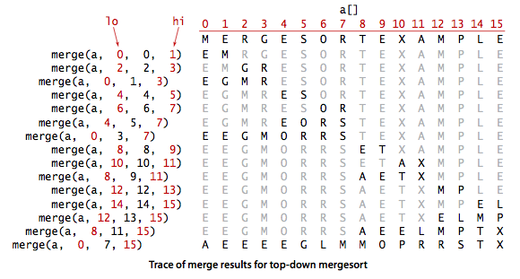

# Note
Supplemental code is also attached at the end.

# 1.4 Analysis of Algorithms


As people gain experience using computers, they use them to solve difficult problems or to process large amounts of data and are invariably led to questions like these:

- _How long will my program take?_
- _Why does my program run out of memory?_


__Scientific method.__ The very same approach that scientists use to understand the natural world is effective for studying the running time of programs:
- _Observe_ some feature of the natural world, generally with precise measurements.
- _Hypothesize_ a model that is consistent with the observations.
- _Predict_ events using the hypothesis.
- _Verify_ the predictions by making further observations.
- _Validate_ by repeating until the hypothesis and observations agree.

The experiments we design must be _reproducible_ and the hypotheses that we formulate must be _falsifiable_.

__Observations.__ Our first challenge is to determine how to make quantitative measurements of the running time of our programs. __stopwatch.py__ is a data type that measures the elapsed running time of a program

```
class Stopwatch:
    # create and start a stop watch
    def __init__(self):

    # returns elapsed time since stopwatch was started
    def elapsed_time(self):
```


__three_sum.py__ counts the number of triples in a file of N integers that sums to 0 (ignoring integer overflow). __doubling_test.py__ generates a sequence of random input arrays, doubling the array size at each step, and prints the running times of __ThreeSum.count()__ for each input size. It also prints the ratios between the inputs.


__Mathematical models.__ The total running time of a program is determined by two primary factors: the cost of executing each statement and the frequency of execution of each statement.

- _Tilde approximations._ We use tilde approximations, where we throw away low-order terms that complicate formulas. We write _~f(N)_ to represent any function that when divided by _f(N)_ approaches 1 as _N_ grows. We write _g(N) ~ f(N)_ to indicate that _g(N) / f(N)_ approaches 1 as _N_ grows.


- _Order-of-growth classifications._ Most often, we work with tilde approximations of the form _g(N) ~ a f(N)_ where _f(N) = N^b log^c N_ and refer to _f(N)_ as the The order of growth of _g(N)_. We use just a few structural primitives (statements, conditionals, loops, nesting, and method calls) to implement algorithms, so very often the order of growth of the cost is one of just a few functions of the problem size _N_.


| Description  | Order of Growth | Typical Code Framework | Description        | Example           |
|--------------|-----------------|------------------------|--------------------|-------------------|
| Constant     | 1               | a = b + c              | statement          | add two numbers   |
| Logarithmic  | log _N_         | [binary_search.py](code/binary_search.py)      | divide in half     | binary search     |
| Linear       | _N_             |                   | for loop           | find the maximum  |
| Linearithmic | _N_ log _N_     | [mergesort.py](code/mergesort.py)                  | divide and conquer | mergesort         |
| Quadratic    | _N_<sup>2</sup> |                   | double for loop    | check all pairs   |
| Cubic        | _N_<sup>3</sup> |                   | triple for loop    | check all triples |
| Exponential  | 2<sup>_N_</sup> | [subsets.py](code/subsets.py)                  | exhaustive search  | check all subsets |

- _Cost model._ We focus attention on properties of algorithms by articulating a cost model that defines the basic operations. For example, an appropriate cost model for the 3-sum problem is the number of times we access an array entry, for read or write.

__Property.__ The order of growth of the running time of [three_sum.py](code/three_sum.py) is N^3.

__Proposition.__ The brute-force 3-sum algorithm uses ~ _N^3 / 2_ array accesses to compute the number of triples that sum to 0 among N numbers.

__Designing faster algorithms.__ One of the primary reasons to study the order of growth of a program is to help design a faster algorithm to solve the same problem. Using mergesort and binary search, we develop faster algorithms for the 2-sum and 3-sum problems.

- _2-sum._ The brute-force solution [two_sum.py](code/two_sum.py) takes time proportional to N^2. [two_sum_fast.py](code/two_sum_fast.py) solves the 2-sum problem in time proportional to N log N time.
- _3-sum._ [three_sum_fast.py](code/three_sum_fast.py) solves the 3-sum problem in time proportional to N^2 log N time.

__Coping with dependence on inputs.__ For many problems, the running time can vary widely depending on the input.

- _Input models._ We can carefully model the kind of input to be processed. This approach is challenging because the model may be unrealistic.
- _Worst-case performance guarantees._ Running time of a program is less than a certain bound (as a function of the input size), no matter what the input. Such a conservative approach might be appropriate for the software that runs a nuclear reactor or a pacemaker or the brakes in your car.
- _Randomized algorithms._ One way to provide a performance guarantee is to introduce randomness, e.g., quicksort and hashing. Every time you run the algorithm, it will take a different amount of time. These guarantees are not absolute, but the chance that they are invalid is less than the chance your computer will be struck by lightning. Thus, such guarantees are as useful in practice as worst-case guarantees.
- _Amortized analysis._ For many applications, the algorithm input might be not just data, but the sequence of operations performed by the client. Amortized analysis provides a worst-case performance guarantee on a sequence of operations.

__Proposition.__ In the linked-list implementation of __Bag__, __Stack__, and __Queue__, all operations take constant time in the worst case.

__Proposition.__ In the resizing-array implementation of __Bag__, __Stack__, and __Queue__, starting from an empty data structure, any sequence of N operations takes time proportional to N in the worst case (amortized constant time per operation).

__Memory usage.__ To estimate how much memory our program uses, we can count up the number of variables and weight them by the number of bytes according to their type. 

## Review Exercises
1. Give the order of growth (as a function of N) of the running times of each of the following code fragments:
```
# Block (a)
sum = 0;
n = N
while n > 0: 
    for i in range(0, n):
        sum += 1;
    n = n // 2


# Block (b)
sum = 0
i = 1
while i < N:
    for j in range(0, i):
        sum += 1
    i = i * 2

# Block (c)
sum = 0
i = 1
while i < N:
    for j in range(0, N):
        sum += 1
    i = i * 2
```

2. __Hot or cold.__ Your goal is the guess a secret integer between 1 and N. You repeatedly guess integers between 1 and N. After each guess you learn if it equals the secret integer (and the game stops); otherwise (starting with the second guess), you learn if the guess is hotter (closer to) or colder (farther from) the secret number than your previous guess. Design an algorithm that finds the secret number in ~ 2 lg N guesses. Then, design an algorithm that finds the secret number in ~ 1 lg N guesses.
Hint: use binary search for the first part. For the second part, first design an algorithm that solves the problem in ~1 lg N guesses assuming you are permitted to guess integers in the range -N to 2N.

3. __Majority.__ Given an array of N strings. An element is a majority if it appears more than N/2 times. Devise an algorithm to identify the majority if it exists. Your algorithm should run in linearithmic time.

4. __Identity.__ Given an array a of N distinct integers (positive or negative) in ascending order. Devise an algorithm to find an index i such that a[i] = i if such an index exists. Hint: binary search.

5. __Find a duplicate.__ Given an array of N elements in which each element is an integer between 1 and N, write an algorithm to determine if there are any duplicates. Your algorithm should run in linear time and use O(1) extra space. Hint: you may destroy the array.

6. __Anagrams.__ Design a O(N log N) algorithm to read in a list of words and print out all anagrams. For example, the strings "comedian" and "demoniac" are anagrams of each other. Assume there are N words and each word contains at most 20 letters. Designing a O(N^2) algorithms should not be too difficult, but getting it down to O(N log N) requires some cleverness.

7. __Monotone 2d array.__ Give an n-by-n array of elements such that each row is in ascending order and each column is in ascending order, devise an O(n) algorithm to determine if a given element x in the array. You may assume all elements in the n-by-n array are distinct.


# 2.1 Elementary Sorts
In this section, we shall study two elementary sorting methods (selection sort and insertion sort)

**Rules of the game.** Our primary concern is algorithms for rearranging arrays of items where each item contains a key. The objective is to rearrange the items such that their keys are in ascending order. With but a few exceptions, our sort code refers to the data only through two operations: the method _less()__ that compares objects and the method _exch()_ that exchanges them.

```
# returns a boolean that evaluates (v < m) 
# using the compareTo method
def less(v, w):
   return (v.compareTo(w) < 0)

# swaps the i,j indices in the input list
def exch(a_list, index_i, index_j):
   a_list[i], a_list[j] = a_list[j], a_list[i]
```

- *Sorting cost model*. When studying sorting algorithms, we count compares and exchanges. For algorithms that do not use exchanges, we count array accesses.

- *Extra memory*. The sorting algorithms we consider divide into two basic types: those that sort in place (no extra memory except perhaps for a small function-call stack or a constant number of instance variables), and those that need enough extra memory to hold another copy of the array to be sorted.
Types of data. Our sort code is effective for any type of data that is a **Comparable**. This means that there is a method *compareTo()* for which _v.compareTo(w)_ returns an integer that is negative, zero, or positive when _v < w, v = w, or v > w_, respectively. The *compareTo()* method must be a total ordering meaning the following 3 properties are satisfied:
    - *Reflexive:* for all _v, v = v_.
    - *Antisymmetric:* for all _v_ and _w_, if (_v_ < _w_) then (_w_ > _v_); and if (_v = w_) then (_w = v_).
    - *Transitive:* for all _v, w_, and _x_, if (_v ≤ w_) and (_w ≤ x_), then _v ≤ x_.
In addition, *v.compareTo(w)* must throw an error if _v_ and _w_ are of incompatible types or if either is null.

Below is an example of a *compareTo* 


**Selection sort.** One of the simplest sorting algorithms works as follows: First, find the smallest item in the array, and exchange it with the first entry. Then, find the next smallest item and exchange it with the second entry. Continue in this way until the entire array is sorted. This method is called selection sort because it works by repeatedly selecting the smallest remaining item. [selection_sort.py](code/selection_sort.py) is an implementation of this method.


**Proposition.** Selection sort uses _~N<sup>2</sup>/2_ compares and n exchanges to sort an array of length _N_.


**Insertion sort.** The algorithm that people often use to sort bridge hands is to consider the cards one at a time, inserting each into its proper place among those already considered (keeping them sorted). In a computer implementation, we need to make space for the current item by moving larger items one position to the right, before inserting the current item into the vacated position. [insertion_sort.py](code/insertion_sort.py) is an implementation of this method, which is called insertion sort.


**Proposition.** For randomly ordered arrays of length _N_ with with distinct keys, insertion sort uses _~N<sup>2</sup>/4_ compares and _~N<sup>2</sup>/4_ exchanges on the average. The worst case is _~ N<sup>2</sup>/2_ compares and _~ N<sup>2</sup>/2_ exchanges and the best case is _N-1_ compares and _0_ exchanges.
Insertion sort works well for certain types of nonrandom arrays that often arise in practice, even if they are huge. An inversion is a pair of keys that are out of order in the array. For instance, E X A M P L E has 11 inversions: E-A, X-A, X-M, X-P, X-L, X-E, M-L, M-E, P-L, P-E, and L-E. If the number of inversions in an array is less than a constant multiple of the array size, we say that the array is partially sorted.

**Proposition.** The number of exchanges used by insertion sort is equal to the number of inversions in the array, and the number of compares is at least equal to the number of inversions and at most equal to the number of inversions plus the array size.

**Property.** For randomly ordered arrays of distinct values, the running times of insertion sort and selection sort are quadratic and within a small constant factor of one another.

**Visualizing sorting algorithms.** We use a simple visual representation to help describe the properties of sorting algorithms. We use vertical bars, to be sorted by their heights.


# Review Exercises

1. Show in the style of the example trace with selection sort, how selection sort sorts the array

```
E A S Y Q U E S T I O N
```

2. What is the maximum number of exchanges involving any particular item during selection sort? What is the average number of exchanges involving an item?

3. Show in the style of the example trace with insertion sort, how insertion sort sorts the array
```
E A S Y Q U E S T I O N
```

4. Which method runs fastest for an array with all keys identical, selection sort or insertion sort?

5. Suppose that we use insertion sort on a randomly ordered array where items have only one of three key values. Is the running time linear, quadratic, or something in between?

6. __Expensive exchange.__ A clerk at a shipping company is charged with the task of rearranging a number of large crates in order of the time they are to be shipped out. Thus, the cost of compares is very low (just look at the labels) relative to the cost of exchanges (move the crates). The warehouse is nearly full: there is extra space sufficient to hold any one of the crates, but not two. Which sorting method should the clerk use?

7. __Stupidsort.__ Analyze the running time (worst case and best case), correctness, and stability of the following sorting algorithm. Scan the array from left to right until you find two consecutive items that are out-of-place. Swap them, and start over from the beginning. Repeat until the scan reaches the end of the array.

```
for i in range(1, N):
    if (less(a[i], a[i-1])):
        exch(i, i-1)
        i = 0
```
Consider also the following recursive variant and analyze the worst case memory usage.
```
@staticmethod
def sort(a):
    for i in range(1, len(a)):
        if (less(a[i], a[i-1])):
            exch(i, i-1);
            sort(a);
```

8. __Bogosort.__ Bogosort is a randomized algorithm that works by throwing the N cards up in the air, collecting them, and checking whether they wound up in increasing order. If they didn't, repeat until they do. Implement bogosort using the shuffling algorithm from Section 1.4. Estimate the running time as a function of N.


# 2.2 Mergesort 

The algorithms that we consider in this section is based on a simple operation known as _merging_: combining two ordered arrays to make one larger ordered array. This operation immediately lends itself to a simple recursive sort method known as _mergesort_: to sort an array, divide it into two halves, sort the two halves (recursively), and then merge the results.


Mergesort guarantees to sort an array of _N_ items in time proportional to _N log N_, no matter what the input. Its prime disadvantage is that it uses extra space proportional to _N_.

__Abstract in-place merge.__ The method merge(a, lo, mid, hi) in [mergesort.py](code/mergesort.py) puts the results of merging the subarrays __a[lo..mid]__ with __a[mid+1..hi]__ into a single ordered array, leaving the result in __a[lo..hi]__. While it would be desirable to implement this method without using a significant amount of extra space, such solutions are remarkably complicated. Instead, __merge()__ copies everything to an auxiliary array and then merges back to the original.


__Top-down mergesort.__ [mergesort.py](code/mergesort.py) has a recursive mergesort implementation based on this abstract in-place merge. It is one of the best-known examples of the utility of the _divide-and-conquer_ paradigm for efficient algorithm design.



__Proposition.__ Top-down mergesort uses between _1/2 N lg N_ and _N lg N_ compares and at most _6 N lg N_ array accesses to sort any array of length _N_.


__Improvements.__ We can cut the running time of mergesort substantially with some carefully considered modifications to the implementation.

- _Use insertion sort for small subarrays._ We can improve most recursive algorithms by handling small cases differently. Switching to insertion sort for small subarrays will improve the running time of a typical mergesort implementation by 10 to 15 percent.

- _Test whether array is already in order._ We can reduce the running time to be linear for arrays that are already in order by adding a test to skip call to __merge()__ if __a[mid]__ is less than or equal to __a[mid+1]__. With this change, we still do all the recursive calls, but the running time for any sorted subarray is linear.

- _Eliminate the copy to the auxiliary array._ It is possible to eliminate the time (but not the space) taken to copy to the auxiliary array used for merging. To do so, we use two invocations of the sort method, one that takes its input from the given array and puts the sorted output in the auxiliary array; the other takes its input from the auxiliary array and puts the sorted output in the given array. With this approach, in a bit of mindbending recursive trickery, we can arrange the recursive calls such that the computation switches the roles of the input array and the auxiliary array at each level.

__Visualization.__ Below is a visualization of mergesort with cutoff for small subarrays.


__Bottom-up mergesort.__ Even though we are thinking in terms of merging together two large subarrays, the fact is that most merges are merging together tiny subarrays. Another way to implement mergesort is to organize the merges so that we do all the merges of tiny arrays on one pass, then do a second pass to merge those arrays in pairs, and so forth, continuing until we do a merge that encompasses the whole array. This method requires even less code than the standard recursive implementation. We start by doing a pass of 1-by-1 merges (considering individual items as subarrays of size 1), then a pass of 2-by-2 merges (merge subarrays of size 2 to make subarrays of size 4), then 4-by-4 merges, and so forth. [mergesort.py](code/mergesort.py) has an implementation of bottom-up mergesort.


__Proposition.__ Bottom-up mergesort uses between _1/2 N lg N_ and _N lg N_compares and at most _6 N lg N_ array accesses to sort any array of length _N_.

__Proposition.__ No compare-based sorting algorithm can guarantee to sort _N_ items with fewer than _lg(N!) ~ N lg N_ compares.

__Proposition.__ Mergesort is an asymptotically optimal compare-based sorting algorithm. That is, both the number of compares used by mergesort in the worst case and the minimum number of compares that any compare-based sorting algorithm can guarantee are _~N lg N_.

# Review Exercises

1. Give traces, in the style of the trace given in this section, showing how the keys `E A S Y Q U E S T I O N` are sorted with top-down mergesort and with bottom-up mergesort.
2. Does the abstract inplace merge produce proper output if and only if the two input subarrays are in sorted order? Prove your answer, or provide a counterexample.
3. Describe in words why mergesort is a stable sort.


# 2.3 Quicksort

Quicksort is popular because it is not difficult to implement, works well for a variety of different kinds of input data, and is substantially faster than any other sorting method in typical applications. It is in-place (uses only a small auxiliary stack), requires time proportional to _N log N_ on the average to sort _N_ items, and has an extremely short inner loop.

__The basic algorithm.__ Quicksort is a divide-and-conquer method for sorting. It works by _partitioning_ an array into two parts, then sorting the parts independently.


The crux of the method is the partitioning process, which rearranges the array to make the following three conditions hold:

- The entry __a[j]__ is in its final place in the array, for some __j__.
- No entry in __a[lo]__ through __a[j-1]__ is greater than __a[j]__.
- No entry in __a[j+1]__ through __a[hi]__ is less than __a[j]__.

We achieve a complete sort by partitioning, then recursively applying the method to the subarrays. It is a _randomized_ algorithm, because it randomly shuffles the array before sorting it.

__Partitioning.__ To complete the implementation, we need to implement the partitioning method. We use the following general strategy: First, we arbitrarily choose __a[lo]__ to be the partitioning item—the one that will go into its final position. Next, we scan from the left end of the array until we find an entry that is greater than (or equal to) the partitioning item, and we scan from the right end of the array until we find an entry less than (or equal to) the partitioning item.


The two items that stopped the scans are out of place in the final partitioned array, so we exchange them. When the scan indices cross, all that we need to do to complete the partitioning process is to exchange the partitioning item __a[lo]__ with the rightmost entry of the left subarray (__a[j]__) and return its index __j__.


__Quicksort.__ [quicksort.py](code/quicksort.py) is an implementation of quicksort, using the partitioning method described above.


__Implementation details.__ There are several subtle issues with respect to implementing quicksort that are reflected in this code and worthy of mention.

- _Partitioning inplace._ If we use an extra array, partitioning is easy to implement, but not so much easier that it is worth the extra cost of copying the partitioned version back into the original.
- _Staying in bounds._ If the smallest item or the largest item in the array is the partitioning item, we have to take care that the pointers do not run off the left or right ends of the array, respectively.
- _Preserving randomness._ The random shuffle puts the array in random order. Since it treats all items in the subarrays uniformly, [quicksort.py](code/quicksort.py) has the property that its two subarrays are also in random order. This fact is crucial to the algorithm's predictability. An alternate way to preserve randomness is to choose a random item for partitioning within __partition()__.
- _Terminating the loop._ Properly testing whether the pointers have crossed is a bit trickier than it might seem at first glance. A common error is to fail to take into account that the array might contain other keys with the same value as the partitioning item.
- _Handling items with keys equal to the partitioning item's key._ It is best to stop the left scan for items with keys greater than or equal to the partitioning item's key and the right scan for items less than or equal to the partitioning item's key. Even though this policy might seem to create unnecessary exchanges involving items with keys equal to the partitioning item's key, it is crucial to avoiding quadratic running time in certain typical applications.
- _Terminating the recursion._ A common mistake in implementing quicksort involves not ensuring that one item is always put into position, then falling into an infinite recursive loop when the partitioning item happens to be the largest or smallest item in the array.

__Proposition.__ Quicksort uses _~2 N ln N_ compares (and one-sixth that many exchanges) on the average to sort an array of length _N_ with distinct keys.
Proposition. Quicksort uses _~N<sup>2</sup>/2_ compares in the worst case, but random shuffling protects against this case.

The standard deviation of the running time is about _.65 N_, so the running time tends to the average as N grows and is unlikely to be far from the average. The probability that quicksort will use a quadratic number of compares when sorting a large array on your computer is much less than the probability that your computer will be struck by lightning!

__Improvements.__ Quicksort was invented in 1960 by C. A. R. Hoare, and it has been studied and refined by many people since that time.

- _Cutoff to insertion sort._ As with mergesort, it pays to switch to insertion sort for tiny arrays. The optimum value of the cutoff is system-dependent, but any value between 5 and 15 is likely to work well in most situations.
- _Median-of-three partitioning._ A second easy way to improve the performance of quicksort is to use the median of a small sample of items taken from the array as the partitioning item. Doing so will give a slightly better partition, but at the cost of computing the median. It turns out that most of the available improvement comes from choosing a sample of size 3 (and then partitioning on the middle item).

__Visualization.__ Below is a visualization of quicksort with median-of-3 partitioning and cutoff for small subarrays.


__Entropy-optimal sorting.__ Arrays with large numbers of duplicate sort keys arise frequently in applications. In such applications, there is potential to reduce the time of the sort from linearithmic to linear.

One straightforward idea is to partition the array into three parts, one each for items with keys smaller than, equal to, and larger than the partitioning item's key. Accomplishing this partitioning was a classical programming exercise popularized by E. W. Dijkstra as the _Dutch National Flag_ problem, because it is like sorting an array with three possible key values, which might correspond to the three colors on the flag.

Dijkstra's solution is based on a single left-to-right pass through the array that maintains a pointer lt such that __a[lo..lt-1]__ is less than __v__, a pointer gt such that __a[gt+1..hi]__ is greater than __v__, and a pointer __i__ such that __a[lt..i-1]__ are equal to __v__, and __a[i..gt]__ are not yet examined.


Starting with __i__ equal to lo we process __a[i]__ using the 3-way compare given us by the compareTo method to handle the three possible cases:

- __a[i]__ less than __v__: exchange __a[lt]__ with __a[i]__ and increment both __lt__ and __i__
- __a[i]__ greater than __v__: exchange __a[i]__ with __a[gt]__ and decrement __gt__
- __a[i]__ equal to __v__: increment __i__


[quicksort_3way.py](code/quicksort_3way.py) is an implementation of this method.

__Proposition.__ Quicksort with 3-way partitioning is entropy-optimal.

__Visualization.__ Below is a visualization of quicksort with 3-way partitioning.


# Review Exercises

1. Show, in the style of the trace given with partition(), how that method partitions the array `E A S Y Q U E S T I O N`.
2. Show, in the style of the quicksort trace, how quicksort sorts the array `E A S Y Q U E S T I O N`. (For the purposes of this exercise, ignore the initial shuffle.)
3. About how many compares will `Quick.sort()` make when sorting an array of N items that are all equal?
4. Show, in the style of the trace given with the code, how the entropy-optimal sort first partitions the array `B A B A B A B A C A D A B R A`
5.  __Bad partitioning.__ How does not stopping on equal keys make quicksort go quadratic when all keys are equal?


# 2.4 Priority Queues

Many applications require that we process items having keys in order, but not necessarily in full sorted order and not necessarily all at once. Often, we collect a set of items, then process the one with the largest key, then perhaps collect more items, then process the one with the current largest key, and so forth. An appropriate data type in such an environment supports two operations: _remove the maximum_ and _insert_. Such a data type is called a _priority queue_.

__API.__ Priority queues are characterized by the _remove the maximum_ and _insert_ operations. By convention, we will compare keys only with a __less()__ method, as we have been doing for sorting. Thus, if records can have duplicate keys, _maximum_ means any record with the largest key value. To complete the API, we also need to add constructors and a test if empty operation. For flexibility, we use a general Key object with a __compareTo__ method. We will use _k_ to refer to an arbitrary Key object.

```
class MaxPriorityQueue:
    # creates a max priority queue of initial capacity max_size if provided
    def __init__(self, max_size = None): 

    # inserts a key into the priority queue
    def insert(self, key): 

    # returns the largest key
    def get_max(self):

    # return and remove the largest key
    def delMax(self):

    # returns a boolean indicating if the priority queue empty
    def isEmpty(self):

    # returns the number of keys in the priority queue
    def size():
```


__Elementary implementations.__ Basic data structures like stacks and queues provide us with four immediate starting points for implementing priority queues.

- _Array representation (unordered)_. Perhaps the simplest priority queue implementation is based on our code for pushdown stacks. The code for _insert_ in the priority queue is the same as for _push_ in the stack. To implement _remove the maximum_, we can add code like the inner loop of selection sort to exchange the maximum item with the item at the end and then delete that one, as we did with __pop()__ for stacks. Program [unordered_array_max_pq.py](code/unordered_array_max_pq.py) implements a priority queue using this approach.
- _Array representation (ordered)._ Another approach is to add code for insert to move larger entries one position to the right, thus keeping the entries in the array in order (as in insertion sort). Thus the largest item is always at the end, and the code for _remove the maximum_ in the priority queue is the same as for pop in the stack. Program [ordered_array_max_pq.py](code/ordered_array_max_pq.py) implements a priority queue using this approach.
- _Linked-list representations (unordered and reverse-ordered)._ Similarly, we can start with our linked-list code for pushdown stacks, either modifying the code for __pop()__ to find and return the maximum or the code for __push()__ to keep items in reverse order and the code for __pop()__ to unlink and return the first (maximum) item on the list.


All of the elementary implementations just discussed have the property that either the insert or the _remove the maximum_ operation takes linear time in the worst case. Finding an implementation where both operations are guaranteed to be fast is a more interesting task, and it is the main subject of this section.

__Heap definitions.__ The _binary heap_ is a data structure that can efficiently support the basic priority-queue operations. In a binary heap, the items are stored in an array such that each key is guaranteed to be larger than (or equal to) the keys at two other specific positions. In turn, each of those keys must be larger than two more keys, and so forth. This ordering is easy to see if we view the keys as being in a binary tree structure with edges from each key to the two keys known to be smaller.

__Definition.__ A binary tree is _heap-ordered_ if the key in each node is larger than (or equal to) the keys in that nodes two children (if any).

__Proposition.__ The largest key in a heap-ordered binary tree is found at the root.

We can impose the heap-ordering restriction on any binary tree. It is particularly convenient, however, to use a _complete_ binary tree like the one below.


We represent complete binary trees sequentially within an array by putting the nodes with _level order_, with the root at position 1, its children at positions 2 and 3, their children in positions 4, 5, 6 and 7, and so on.

__Definition.__ A _binary heap_ is a set of nodes with keys arranged in a complete heap-ordered binary tree, represented in level order in an array (not using the first entry).


In a heap, the parent of the node in position _k_ is in position _k/2_; and, conversely, the two children of the node in position _k_ are in positions _2k_ and _2k + 1_. We can travel up and down by doing simple arithmetic on array indices: to move up the tree from __a[k]__ we set _k_ to _k/2_; to move down the tree we set _k_ to _2*k_ or _2*k+1_.

__Algorithms on heaps.__ We represent a heap of size _n_ in private array __pq[]__ of length _n + 1_, with __pq[0]__ unused and the heap in __pq[1]__ through __pq[n]__. We access keys only through private helper functions __less()__ and __exch()__. The heap operations that we consider work by first making a simple modification that could violate the heap condition, then traveling through the heap, modifying the heap as required to ensure that the heap condition is satisfied everywhere. We refer to this process as _reheapifying_, or _restoring heap order_.

- _Bottom-up reheapify (swim)._ If the heap order is violated because a node's key becomes larger than that node's parents key, then we can make progress toward fixing the violation by exchanging the node with its parent. After the exchange, the node is larger than both its children (one is the old parent, and the other is smaller than the old parent because it was a child of that node) but the node may still be larger than its parent. We can fix that violation in the same way, and so forth, moving up the heap until we reach a node with a larger key, or the root.


```
def _swim(self, k):
   while k > 1 and self.less(k/2, k)):
      self.exch(k, k/2);
      k = k/2;
```


- _Top-down heapify (sink)._ If the heap order is violated because a node's key becomes smaller than one or both of that node's children's keys, then we can make progress toward fixing the violation by exchanging the node with the larger of its two children. This switch may cause a violation at the child; we fix that violation in the same way, and so forth, moving down the heap until we reach a node with both children smaller, or the bottom.


```
def _sink(self, k):
    while 2*k <= N:j = 2*k
        if j < N && self.less(j, j+1)):
            j += 1
        if (!self.less(k, j)):
            break
        self.exch(k, j);
        k = j;
```


__Heap-based priority queue.__ These __sink()__ and __swim()__ operations provide the basis for efficient implementation of the priority-queue API, as diagrammed below and implemented in [max_pq.py](code/max_pq.py) and [min_pq.py](code/min_pq.py).

- _Insert._ We add the new item at the end of the array, increment the size of the heap, and then swim up through the heap with that item to restore the heap condition.
- _Remove the maximum._ We take the largest item off the top, put the item from the end of the heap at the top, decrement the size of the heap, and then sink down through the heap with that item to restore the heap condition.


__Proposition.__ In an _n_-item priority queue, the heap algorithms require no more than 1 + lg n compares for _insert_ and no more than _2 lg n_ compares for _remove the maximum_.

__Practical considerations.__ We conclude our study of the heap priority queue API with a few practical considerations.
- _Multiway heaps._ It is not difficult to modify our code to build heaps based on an array representation of complete heap-ordered ternary or _d_-ary trees. There is a tradeoff between the lower cost from the reduced tree height and the higher cost of finding the largest of the three or _d_ children at each node.
- _Array resizing._ We can add a no-argument constructor, code for array doubling in __insert()__, and code for array halving in __delMax()__, just as we did for stacks in Section 1.3. The logarithmic time bounds are amortized when the size of the priority queue is arbitrary and the arrays are resized.
- _Immutability of keys._ The priority queue contains objects that are created by clients but assumes that the client code does not change the keys (which might invalidate the heap invariants).

__Heapsort.__ We can use any priority queue to develop a sorting method. We insert all the keys to be sorted into a minimum-oriented priority queue, then repeatedly use _remove the minimum_ to remove them all in order. When using a heap for the priority queue, we obtain _heapsort_.

Focusing on the task of sorting, we abandon the notion of hiding the heap representation of the priority queue and use __swim()__ and __sink()__ directly. Doing so allows us to sort an array without needing any extra space, by maintaining the heap within the array to be sorted. Heapsort breaks into two phases: _heap construction_, where we reorganize the original array into a heap, and the _sortdown_, where we pull the items out of the heap in decreasing order to build the sorted result.

- _Heap construction._ We can accomplish this task in time proportional to _n lg n_,by proceeding from left to right through the array, using __swim()__ to ensure that the entries to the left of the scanning pointer make up a heap-ordered complete tree, like successive priority queue insertions. A clever method that is much more efficient is to proceed from right to left, using __sink()__ to make subheaps as we go. Every position in the array is the root of a small subheap; __sink()__ works or such subheaps, as well. If the two children of a node are heaps, then calling __sink()__ on that node makes the subtree rooted there a heap.
- _Sortdown._ Most of the work during heapsort is done during the second phase, where we remove the largest remaining items from the heap and put it into the array position vacated as the heap shrinks.


Below is a trace of the contents of the array after each sink.


__Proposition.__ Sink-based heap construction is linear time.


__Proposition.__ Heapsort users fewer than _2 n lg n_ compare and exchanges to sort n items.

Most items reinserted into the heap during sortdown go all the way to the bottom. We can thus save time by avoiding the check for whether the item has reached its position, simply promoting the larger of the two children until the bottom is reached, then moving back up the heap to the proper position. This idea cuts the number of compares by a factor of 2 at the expense of extra bookkeeping.

# Review Exercises
1. Suppose that the sequence
```
P R I O * R * * I * T * Y * * * Q U E * * * U * E
```
(where a letter means insert and an asterisk means remove the maximum) is applied to an initially empty priority queue. Give the sequence of values returned by remove the maximum operations.

2. Criticize the following idea: to implement find the maximum in constant time, why not keep track of the maximum value inserted so far, then return that value for find the maximum?
3. Is an array that is sorted in decreasing order a max-oriented heap?
4. Suppose that your application will have a huge number of insert operations, but only a few remove the maximum operations. Which priority-queue implementation do you think would be most effective: heap, unordered array, ordered array?
5. Suppose that your application will have a huge number of find the maximum operations, but a relatively small number of insert and remove the maximum operations. Which priority queue implementation do you think would be most effective: heap, unordered array, ordered array?
6. __Best, average, and worst case of heapsort.__ What's are the best case, average case, and worst case number of compares for heapsorting an array of length n?
7. __Top k sums of two sorted arrays.__ Given two sorted arrays `a[]` and `b[]`, each of length n, find the largest k sums of the form `a[i] + b[j]`.
8. __Challenge Question (this is tough!): Dynamic-median finding.__  Design a data type that supports insert in logarithmic time, find the median in constant time, and remove the median in logarithmic time.


