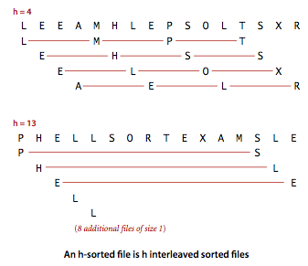
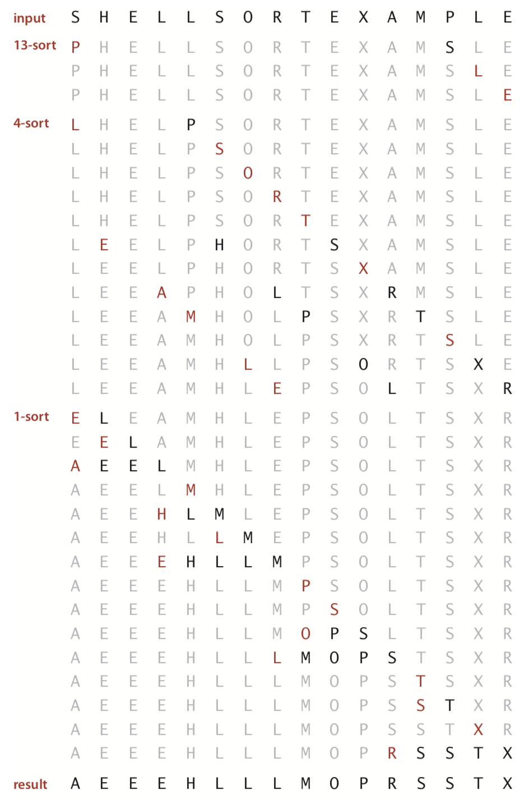
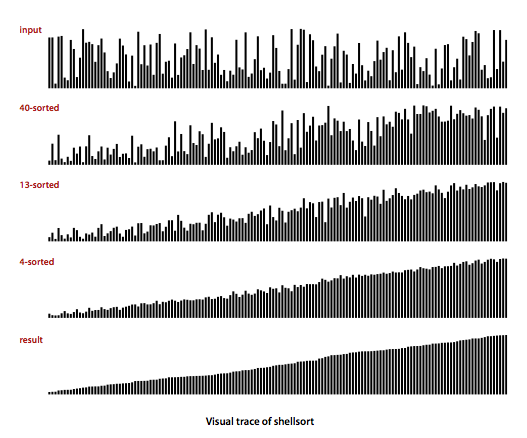

# Shellsort

Shellsort is a another version of insertion sort that gains speed by allowing exchanges of entries that are far apart, to produce partially sorted arrays that can be efficiently sorted, eventually by insertion sort. The idea is to rearrange the array to give it the property that taking every `h` elements (starting anywhere) yields a sorted sequence. Such an array is said to be `h-sorted`.

Consider the following example



By `h-sorting` for some large values of h, we can move entries in the array long distances and thus make it easier to `h-sort` for smaller values of h. Using such a procedure for any increment sequence of values of `h` that ends in 1 will produce a sorted array: that is shellsort. The reason the shells end with size 1 is to ensure the array is sorted (this is simply insertion sort). 



[shellsort.py](shellsort.py) implements shellsort in Python. 

```
def shellsort(arr):
    N = len(arr)

    # We find the shell size to start with.
    # This assumes we use the sequence
    # 1,4,13,40,... 3n + 1,...
    h = 1 
    while h < N // 3:
        h = 3 * h + 1
    
    # Now for each shell size h, we h-sort the array.
    while h > 0:
        for i in range(h, N):
            j = i
            # Swap the adjacent elements in the shell as needed.
            while j >= h and arr[j] < arr[j-h]:
                arr[j], arr[j-h] = arr[j-h], arr[j]
                j -= h
        h = h // 3
    return arr
```

Below is a visualization of the Shellsort algorithm on an example input where the shell sizes are 1,4,13,40. The shells are continually equal to 1 plus 3 times the next smallest shell size. Notice that each time we reduce the shell size, the array gets _closer_ to being sorted as can be seen in the visualization. This makes it so that the final shell size of 1, will be much faster than if we had simply used insertion sort from the beginning.

